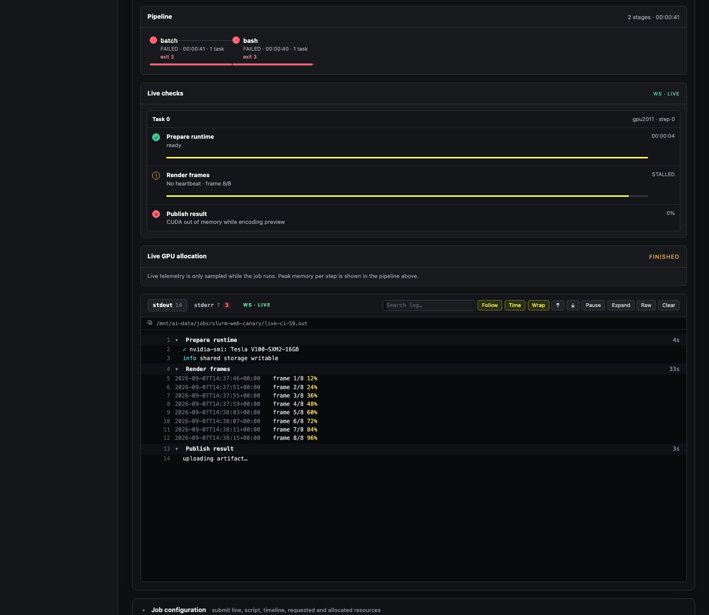
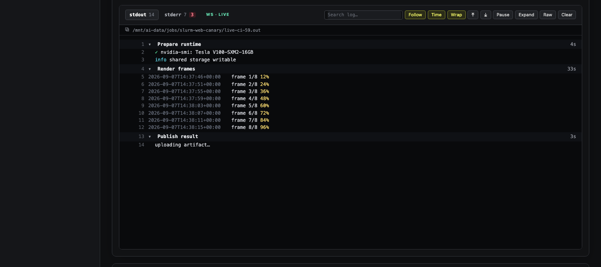
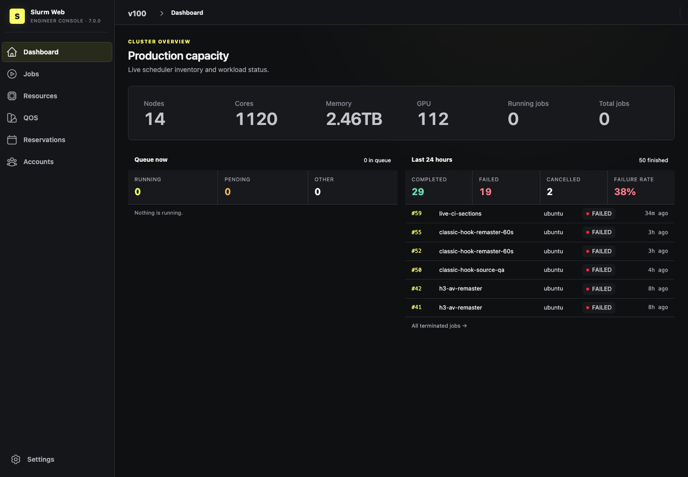
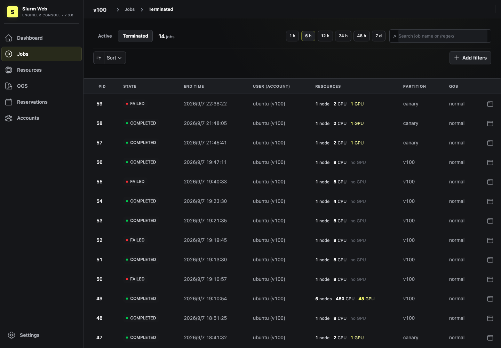
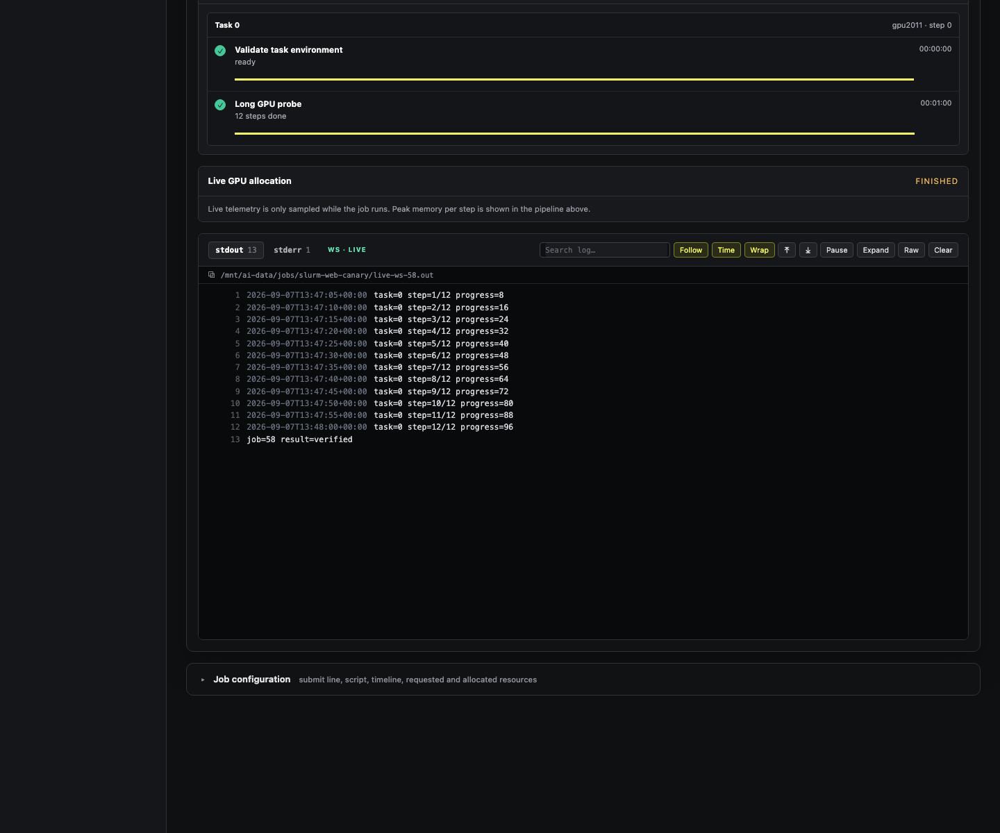
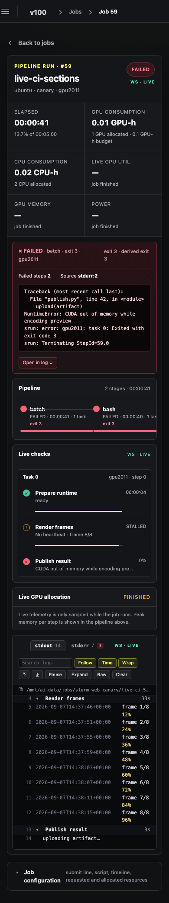

# Slurm-web · Engineer Console fork

> A fork of [rackslab/slurm-web](https://github.com/rackslab/slurm-web) (v7.0.0)
> that turns the job page into an engineer's workbench: a CI-style pipeline
> view with live logs, live GPU telemetry, structured task checks and failure
> diagnostics, all over one WebSocket, in a ClickHouse-inspired dark UI.
> Upstream Slurm-web is unchanged underneath: same agent/gateway split, same
> RBAC, same REST API, same configuration files.

Status: running as a canary on a 14-node V100 cluster. The upstream README
follows [below](#slurm-web).

<p align="center">

</p>

<p align="center">

</p>

<details>
<summary>More screenshots: dashboard, terminated jobs, a completed job, mobile</summary>
<p align="center">
<br>
<br>
<br>

</p>
</details>

## What this fork adds

**Pipeline job page.** Every job opens like a CI run: status, elapsed time
against the time limit, GPU-hours and CPU-hours consumed, Slurm steps drawn as
stages with exit codes and a relative time bar, and the output streamed live
underneath.

**CI-style job log** (modelled on GitLab and GitHub Actions job logs):
numbered, anchorable lines; ANSI colors; timestamps; error and warning lines
highlighted; search with match navigation; follow, pause, wrap and expand;
stdout/stderr tabs with line and error counts; raw download. Sections fold the
log with durations using GitLab `section_start`/`section_end` or GitHub
`::group::` markers — `slurm-check section start prepare "Prepare runtime"` is
all a job script needs. A stage whose name matches a section jumps to it.

**Failure summary first.** When a job fails, the page opens with the state,
failed step, exit / derived exit code or signal, and an error excerpt that the
agent extracts from the tail of stderr (or stdout): the last Python traceback,
CUDA out of memory, `srun: error`, and so on. One click opens that line in
the log.

**Live checks.** Tasks emit structured check events (`queued`, `running` with
progress, `passed`, `failed`, `warning`, `skipped`, `cancelled`) with the
[`slurm-check`](contrib/slurm-check) CLI. Each task writes its own append-only
JSONL file on shared storage; the web shows one card per task, marks checks
`stalled` after 15 s without a heartbeat and updates without reloading.

**Live GPU telemetry.** A small per-node collector
([`contrib/slurm-web-gpu-snapshot.py`](contrib/slurm-web-gpu-snapshot.py))
samples `nvidia-smi` every two seconds and correlates processes with job ids,
so the job page shows utilisation, VRAM, power and temperature per allocated
GPU while the job runs.

**One WebSocket per job.** Checks, log, GPU and job state share
`ws(s)://<gateway>/api/agents/<cluster>/job/<id>/live`. The browser sends the
bearer token as its first frame (never in the URL), subscribes with one cursor
per channel (event sequence for checks, byte offset per output stream) and
resumes losslessly after a reconnect. The gateway relays frames verbatim to a
second WebSocket on the agent. SSE and polling endpoints stay as fallback. See
[docs/modules/usage/pages/live-checks.adoc](docs/modules/usage/pages/live-checks.adoc)
for the protocol.

**Engineer-facing lists and dashboard.** Active / Terminated tabs with search
and time range presets, resources spelled out (`1 node · 8 CPU · 48 GPU`),
a dashboard with queue composition, last 24 hours outcomes and failure rate,
recent failures and running jobs — all from the scheduler and accounting APIs,
no Prometheus required. Job URLs can be shared as deep links.

**ClickHouse-inspired UI.** Dense dark workbench, terminal-first surfaces, a
single yellow accent reserved for what is running.

## Trying it

The fork builds like upstream (`containers/Dockerfile`, `frontend/`). For a
fast canary on top of the published v7.0.0 images there is an overlay build:

```console
$ npm --prefix frontend ci && npm --prefix frontend run build
$ docker build -f containers/Dockerfile.overlay --target agent   -t slurm-web-agent:console .
$ docker build -f containers/Dockerfile.overlay --target gateway -t slurm-web-gateway:console .
```

The agent needs read access to the job output directories, the check events
directory and the GPU snapshot directory. Their locations are environment
variables (defaults shown):

| Variable | Purpose | Default |
| --- | --- | --- |
| `SLURMWEB_LOG_ROOTS` | colon-separated roots the agent may read job output from | `/mnt/ai-data/jobs:/tank/ai/data/jobs` |
| `SLURMWEB_CHECKS_ROOT` | where `slurm-check` writes `<job>/<step>/task-<rank>.jsonl` | `/mnt/ai-data/.slurm-web/checks` |
| `SLURMWEB_GPU_ROOT` | where the GPU collector writes `<node>.json` | `/mnt/ai-data/.slurm-web/gpu` |
| `SLURMWEB_THREADS` | Gunicorn threads per worker (one per open live session) | `32` |

Install `contrib/slurm-check` on compute nodes and, optionally, the GPU
collector as a systemd service (`contrib/slurm-web-gpu-snapshot.service`).
A job script then looks like:

```bash
slurm-check section start load-model "Load model"
slurm-check running load-model --progress 40 --message "shard 12/29"
python train.py
slurm-check passed load-model --duration-ms 31042
slurm-check section end load-model
```

An end-to-end test of the live session under real Gunicorn workers lives in
[`dev/live-e2e`](dev/live-e2e/README.md).

## Relationship to upstream

All credit for Slurm-web goes to [Rackslab](https://rackslab.io). This fork
tracks the upstream v7.0.0 release and keeps its MIT license; the additions are
also MIT. Pieces that are generally useful (live WebSocket session, log
viewer, diagnostics endpoint) are candidates for upstream proposals once they
have settled.

---

# Slurm-web

## Overview


Slurm-web is an open source web dashboard for Slurm based HPC clusters.

[Slurm](https://slurm.schedmd.com/) is the world leading workload manager for
HPC clusters with all most advanced features to manage jobs and resources
efficiently with a powerful command-line interface (CLI).

Slurm-web provides a clear graphical user interface with views to track your
jobs, intuitive insights and advanced visualizations on top of Slurm to monitor
status of HPC supercomputers in your organization, in a web browser on all your
devices.

<p align="center">

<p>

Many features in a reactive & responsive web UI:

* Dashboard with interactive charts of resources and jobs status
* Instant jobs filtering and sorting
* Live jobs status update
* Colored badges to visualize job status at a glance
* GPU resources utilization monitoring
* Advanced visualization of node status with racking topology
* Intuitive visualization of account tree, QOS and advanced reservations
* Dark mode support
* Custom UI branding (colors, logos, favicon)
* Multi-clusters support
* LDAP authentication (including Active Directory support)
* SSO OpenID Connect (OIDC) authentication (ex: Keycloak, Authentik, etc)
* Advanced RBAC permissions management
* Transparent caching
* Integration with Prometheus to collect and chart timeseries metrics of Slurm

Get more details in
[Slurm-web advanced features overview](https://docs.rackslab.io/slurm-web/overview/overview.html).

<p align="center">

<p>


## Quickstart

To install and start using Slurm-web in a few steps, follow the
[quickstart guide](https://docs.rackslab.io/slurm-web/install/quickstart/index.html)!
Containers and system packages are available for most Linux distributions for
easy installation and upgrade.

## Documentation

The [full documentation](https://docs.rackslab.io/slurm-web/) of Slurm-web is
available online with software architecture details, installation guide,
configuration references, troubleshooting guide, etc.

## Status

Slurm-web is considered stable and ready for production.

## Authors

Slurm-web is developed and maintained by [Rackslab](https://rackslab.io),
software editor of open source solutions designed to help HPC supercomputers
administration, operations and management.

## Support

Need help to deploy or setup Slurm-web? There are multiple ways to get technical
support.

### Community

Multiple community channels are available to ask questions:

* **Matrix Chat** [#slurm-web:talk.rackslab.io](https://matrix.to/#/#slurm-web:talk.rackslab.io):
  instant messaging for quick feedback and help.

> [!NOTE]
> A [Matrix account](https://matrix.org/docs/chat_basics/matrix-for-im/#creating-a-matrix-account)
> is required to access the chat room. It can be created in few steps on any
> Matrix network public provider such as [matrix.org](https://matrix.org) or
> [gitter.im](https://gitter.im/#apps).

* [**GitHub Discussions Q&A**](https://github.com/rackslab/slurm-web/discussions/categories/q-a):
  post your questions with more context and details for more in-depth answers.

This support is provided by the community with best-effort participation of
Rackslab team. Please mind that people might not be available to answer your
questions.

### Professional

[Rackslab](https://rackslab.io) offers commercial support to help organizations
secure their deployment of Slurm-web with service level agreement (SLA) and
minimal response time.

Our professional team has a unique expertise to offer a wide range of services
from assistance to setup the installation to the most advanced bug resolution.
[Contact us](https://rackslab.io/en/contact/) for more information.

## Development

Want to contribute? Documentation to deploy a development environment is
available in
[development README.md](https://github.com/rackslab/slurm-web/blob/main/dev/README.md)

## License

Slurm-web is distributed under the terms of the MIT license.
